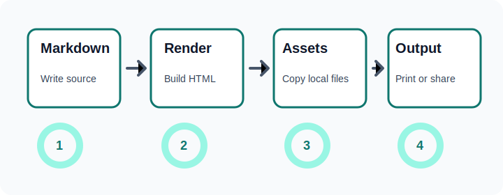

# Image Asset Workflow

This example includes a local relative image. When rendering to an HTML file,
Towel.txt copies the image beside the generated output. Use `--asset-dir` to
place copied images under a dedicated output directory.



## Command

```bash
towel-txt examples/image-workflow.md --output dist/examples/image-workflow.html --asset-dir assets --strict
```

## Expected Result

- The HTML file is written to `dist/examples/image-workflow.html`.
- The source image is copied to `dist/examples/assets/images/workflow.svg`.
- The generated image reference points to the copied asset path.
